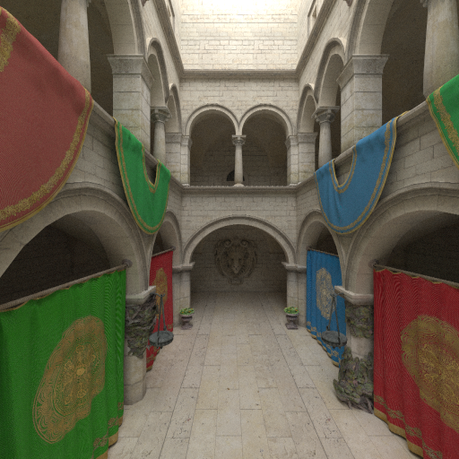
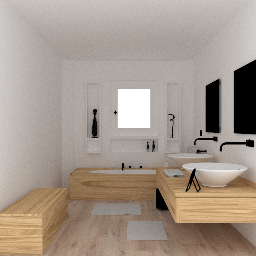
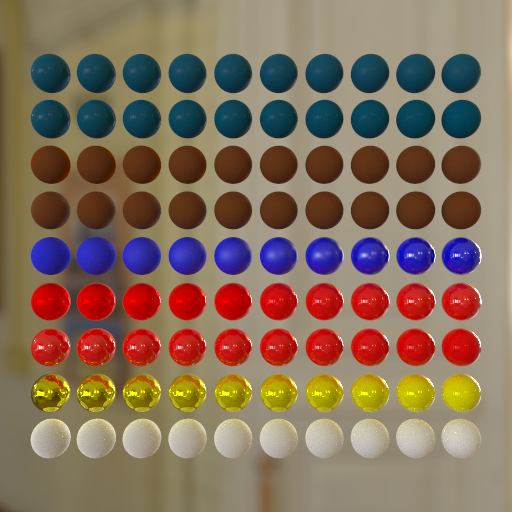

# LTRE

montecarlo raytracer for my research

## Features

* Unidirectional Path Tracing
* Path Tracing with Next Event Estimation 
* BVH
* Model Loading
* Disney BRDF([Burley 2012](https://www.disneyanimation.com/publications/physically-based-shading-at-disney/))
* Microfacet BTDF([Walter 2007](https://dl.acm.org/doi/10.5555/2383847.2383874))

## Requirements

* C++20
* CMake 3.20
* OpenMP

## Build

```
mkdir build
cd build
cmake ..
cmake --build .
```

## Gallery





## Externals

* [stb](https://github.com/nothings/stb)
* [assimp](https://github.com/assimp/assimp)
* [spdlog](https://github.com/gabime/spdlog)
* [GoogleTest](https://github.com/google/googletest)